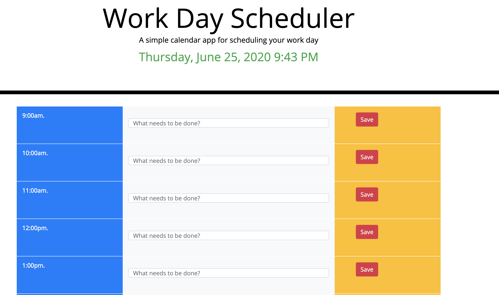

# Work-Day-Scheduler
Calendar application that allows the user to save events for each hour of the day. This app will run in the browser and feature dynamically updated HTML and CSS powered by jQuery.
 
## Getting Started
These instructions will get you a copy of the project up and running on your local machine for development and testing purposes. See deployment for notes on how to deploy the project on a live system.

```
$ git clone git@github.com:Cherjios/Work-Day-Scheduler.git
$ cd Work-Day-Scheduler.git
```
Then open in your preferred text editor:
- [vim](https://www.vim.org/) 
- [emmacs](https://www.gnu.org/software/emacs/)
- [visual studio code](https://code.visualstudio.com/) 

## Website view



## Built With

* [HTML](https://developer.mozilla.org/en-US/docs/Web/HTML)
* [CSS](https://developer.mozilla.org/en-US/docs/Web/CSS)
* [JS](https://developer.mozilla.org/en-US/docs/Web/JavaScript)

## Deployed Link

* [Deploy a website to github](https://www.google.com/search?rlz=1C5CHFA_enUS876US878&sxsrf=ALeKk03L-krWYrY46bsiZVRE3DFHIEULGA%3A1591932240148&ei=UPXiXsrBCLW90PEPsvWSwAY&q=deploy+a+website+on+github&oq=deploy+a+website+on+github&gs_lcp=CgZwc3ktYWIQAzIECAAQQzIGCAAQFhAeMgYIABAWEB4yBggAEBYQHjoECCMQJzoFCAAQkQI6BQgAELEDOgcIABCxAxBDOgIIADoHCAAQFBCHAlDcMFjZUmDGVGgAcAB4AIABZogBoAeSAQQxMC4xmAEAoAEBqgEHZ3dzLXdpeg&sclient=psy-ab&ved=0ahUKEwjKqbjdqfvpAhW1HjQIHbK6BGgQ4dUDCAw&uact=5)


## Authors

* **SERGIO LOPEZ** 

- [Link to Portfolio Site](#)
- [Link to Github](https://github.com/cherjios)
- [Link to LinkedIn](https://www.linkedin.com/in/sergio-lopez-81790579)


